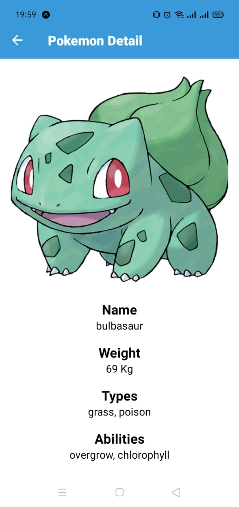
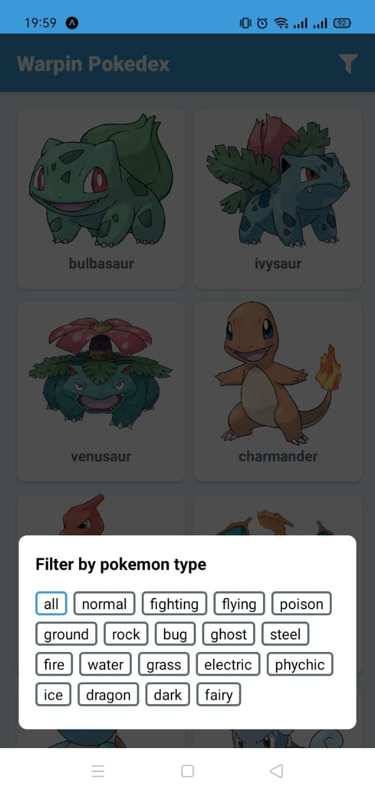
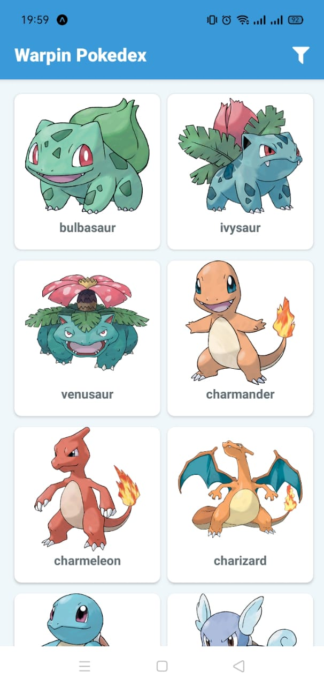

# PokemonWepe

Pokemon infinite list with detail and filter by type





## Prerequisite

Make sure you have installed the [Expo Client](https://expo.io/tools#client) app in your android phone. **Shared Expo project link is not working on iOS** please refer to publishing limitation in [here](https://docs.expo.io/workflow/publishing/).

Install Expo CLI

```bash
npm install -g expo-cli
```

## Install packages

```bash
npm i
```

or

```bash
yarn
```

## Usage

```bash
expo start
```

## Run Test

```bash
npm run test
```

or

```bash
yarn test
```

## Built with

- [React Native](https://reactnative.dev/)
- [Rematch](https://github.com/rematch/rematch)
- [PokeAPI](https://pokeapi.co)
- [Expo](https://expo.io/)
